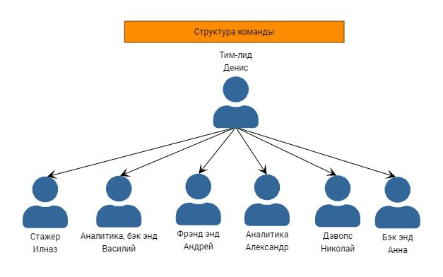

## 2.6. Организация работы

### Структура команды

- Денис ответственный за создание баз данных SQL.
- Александр ответственный за обработку SQL запросов.
- Василий ответственный за регистрацию и админскую часть.
- Анна ответственный за создание логики бота.
- Андрей ответственный за UX/UI.
- Николай ответственный за девопсерскую часть.
- Ильназ ответственный за тестирование телеграм бота.
